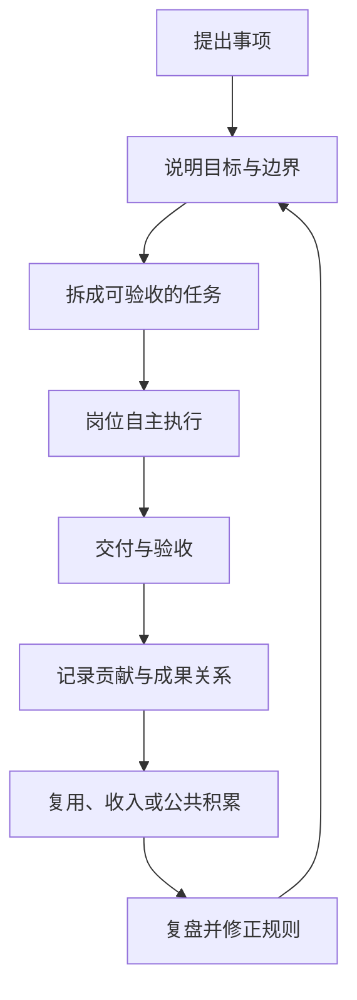

# 整体框架

共创最容易出现两个极端。一个极端是所有事情都等负责人决定，参与者只能领任务；另一个极端是人人都能发言，却没人对结果负责。这套框架希望在两者之间建立一个清楚的工作秩序：共同决定方向，分散处理具体问题，结果可以验收，贡献可以追溯，规则可以根据反馈调整。

## 六个部分

| 部分 | 要解决的问题 |
| --- | --- |
| 共同方向 | 我们为什么一起做，哪些底线不能越过 |
| 岗位与权限 | 谁可以决定什么，需要交付什么 |
| 任务与成果 | 一件工作怎样被拆开、完成、验收和复用 |
| 贡献账本 | 谁做了什么，成果后来产生了什么价值 |
| 共同治理 | 哪些事可以个人决定，哪些事必须共同决定 |
| 反馈与修正 | 发现偏差以后，由谁调整、何时调整、怎样留下记录 |

这六个部分缺一不可。只有愿景而没有岗位，事情会停在讨论里；只有任务而没有治理，权力会悄悄回到少数人手里；只有贡献值而没有验收和复盘，数字很快就会失真。

## 一件工作的完整过程

每一步都应留下最少但足够的记录。记录的目的不是增加手续，而是让后来的人知道：当时为什么这样决定、成果从哪里来、出了问题应该找谁。

## 三种基本对象

### 岗位

岗位是一段持续存在的责任，例如统筹、编剧、角色设定、技术维护。岗位拥有一定范围内的决定权，也要对持续结果负责。

### 任务

任务是有开始和结束的一次性交付，例如完成一版人物小传、修复一个功能、核对一批资料。任务必须能被验收。

### 成果

成果是可以继续使用的东西，例如文本、设定、代码、流程、素材、研究结论。成果需要保留来源和版本，后续复用时才能把价值追溯回原贡献者。

岗位负责连续性，任务负责推进，成果负责积累。三者不能混在一张表里。

## 最少需要共同维护的四本账

1. **事项账**：正在做什么，处于什么状态，谁负责验收。
2. **成果账**：产出了什么，版本和依赖关系是什么，能否复用。
3. **贡献账**：谁完成了哪些工作，怎样计算，是否有异议。
4. **决策账**：重要决定的背景、参与者、结果和复查日期。

工具可以更换，四本账的逻辑不要轻易更换。这样平台即使迁移，协作关系也不会跟着丢失。

## 自主与共同约束怎样同时存在

共同层只负责少数事情：方向、公共规则、跨组资源、重大风险和争议。其他判断尽量留在最接近工作现场的岗位。

判断一件事应该在哪一层决定，可以问三个问题：

1. 结果主要影响谁？
2. 决定是否容易撤回？
3. 是否会占用公共资产、改变共同承诺或影响其他节点？

影响局部、容易撤回、没有占用公共资产的决定，由岗位自己作出。影响多个节点、难以撤回或涉及共同资产的决定，才进入共同治理。

