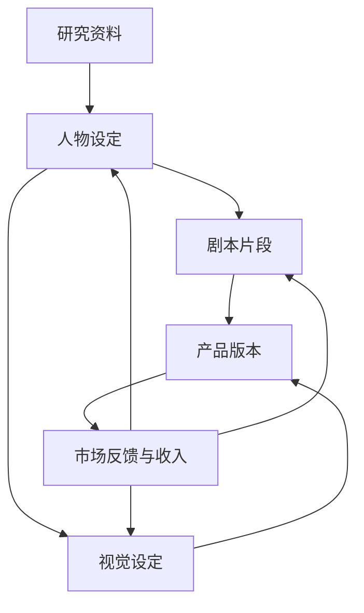

# 网状协作结构

传统组织图主要回答“谁向谁汇报”。共创项目还需要回答另外三个问题：谁依赖谁的成果，谁正在共同使用一项资产，一项成果产生价值以后应该回到哪里。

因此，这里的基本结构不是一棵只表示上下级的树，而是一张由岗位、任务和成果组成的网。

## 节点与连接

一个节点可以是岗位、任务、成果或项目。连接表示它们之间的真实关系，例如：

- 某个任务需要一份研究资料作为输入；
- 某个人物设定被多个剧本片段复用；
- 某项技术组件服务于多个产品；
- 某个市场收入来自一组可以追溯的成果。

这张网的价值不在于画得复杂，而在于让依赖和复用看得见。

## 每个工作节点都有输入和输出

任务开始时至少记录：

- 输入来自哪里；
- 需要解决什么问题；
- 输出以什么形式交付；
- 谁会使用输出；
- 验收由谁完成；
- 如果输出被继续修改，怎样保留来源。

只有输出名称而没有使用者，容易制造无人使用的成果；只有输入而没有来源，后续很难判断内容是否可靠。

## 网状结构的四条规则

### 一项成果只建立一个权威入口

允许复制和派生，但要标明原始来源和版本。不要让同一个成果在多个地方各自变成“最新版”。

### 复用关系必须留下记录

复用不是简单下载。应记录复用了哪个版本、用于什么成果、是否做过修改。这样既能维护质量，也能计算后续贡献。

### 接口变化要通知受影响节点

一个节点可以自主改变内部做法，但如果改变了别人依赖的输出格式、时间或含义，就必须与相邻节点确认。

### 公共节点需要明确维护者

被很多人依赖的模板、资料库、代码或品牌资产不能处于“大家都能改、没人负责”的状态。它们需要维护者、变更记录和替代方案。

## 怎样避免网络变成混乱

节点越多，越不能靠所有人互相同步。可以采用三种办法：

1. 把协作接口写清楚，减少不必要的沟通；
2. 只把异常和跨节点冲突送到共同层处理；
3. 定期检查少数关键节点，而不是平均检查所有人。

网状结构不是取消秩序，而是把秩序从“服从一条指挥链”改成“遵守清楚的接口和反馈规则”。

